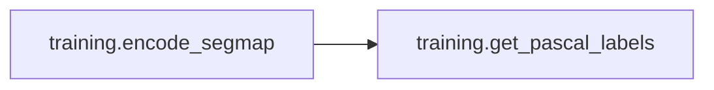
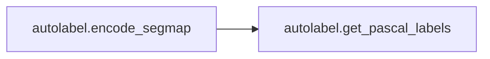
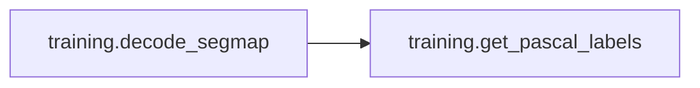
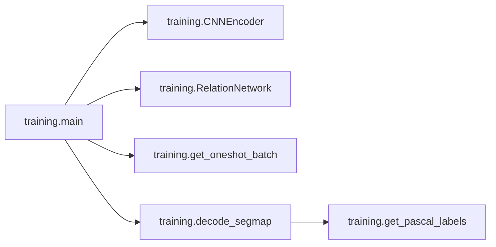
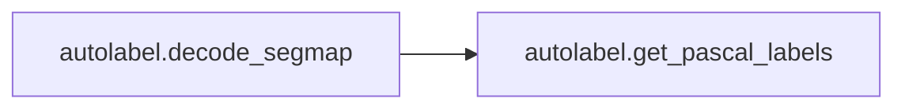
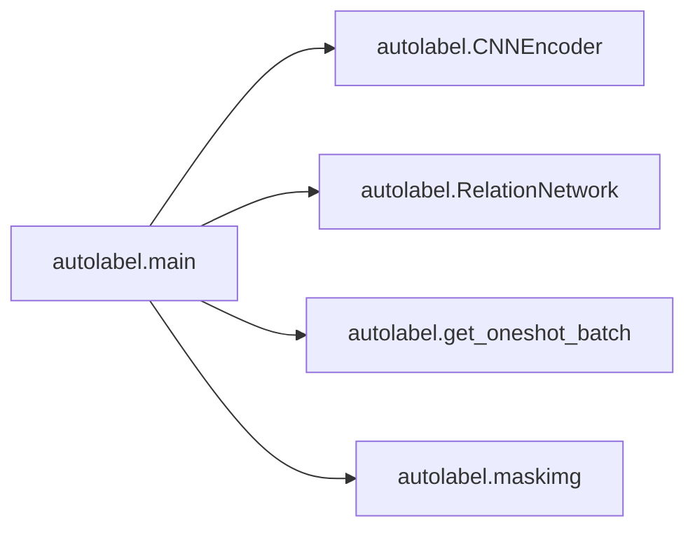

# Key Objects

[_Documentation generated by Documatic_](https://www.documatic.com)

<!---Documatic-section-training.weights_init-start--->
## training.weights_init

<!---Documatic-section-weights_init-start--->
<!---Documatic-block-training.weights_init-start--->
<details>
	<summary><code>training.weights_init</code> code snippet</summary>

```python
def weights_init(m):
    classname = m.__class__.__name__
    if classname.find('Conv') != -1:
        n = m.kernel_size[0] * m.kernel_size[1] * m.out_channels
        m.weight.data.normal_(0, math.sqrt(2.0 / n))
        if m.bias is not None:
            m.bias.data.zero_()
    elif classname.find('BatchNorm') != -1:
        m.weight.data.fill_(1)
        m.bias.data.zero_()
    elif classname.find('Linear') != -1:
        n = m.weight.size(1)
        m.weight.data.normal_(0, 0.01)
        m.bias.data = torch.ones(m.bias.data.size())
```
</details>
<!---Documatic-block-training.weights_init-end--->
<!---Documatic-section-weights_init-end--->

# #
<!---Documatic-section-training.weights_init-end--->

<!---Documatic-section-training.get_pascal_labels-start--->
## training.get_pascal_labels

<!---Documatic-section-get_pascal_labels-start--->
<!---Documatic-block-training.get_pascal_labels-start--->
<details>
	<summary><code>training.get_pascal_labels</code> code snippet</summary>

```python
def get_pascal_labels():
    return np.asarray([[0, 0, 0], [128, 0, 0], [0, 128, 0], [128, 128, 0], [0, 0, 128], [128, 0, 128], [0, 128, 128], [128, 128, 128], [64, 0, 0], [192, 0, 0], [64, 128, 0], [192, 128, 0], [64, 0, 128], [192, 0, 128], [64, 128, 128], [192, 128, 128], [0, 64, 0], [128, 64, 0], [0, 192, 0], [128, 192, 0], [0, 64, 128]])
```
</details>
<!---Documatic-block-training.get_pascal_labels-end--->
<!---Documatic-section-get_pascal_labels-end--->

# #
<!---Documatic-section-training.get_pascal_labels-end--->

<!---Documatic-section-training.encode_segmap-start--->
## training.encode_segmap

<!---Documatic-section-encode_segmap-start--->


### Object Calls

* training.get_pascal_labels

<!---Documatic-block-training.encode_segmap-start--->
<details>
	<summary><code>training.encode_segmap</code> code snippet</summary>

```python
def encode_segmap(mask):
    mask = mask.astype(int)
    label_mask = np.zeros((mask.shape[0], mask.shape[1]), dtype=np.int16)
    for (ii, label) in enumerate(get_pascal_labels()):
        label_mask[np.where(np.all(mask == label, axis=-1))[:2]] = ii
    label_mask = label_mask.astype(int)
    return label_mask
```
</details>
<!---Documatic-block-training.encode_segmap-end--->
<!---Documatic-section-encode_segmap-end--->

# #
<!---Documatic-section-training.encode_segmap-end--->

<!---Documatic-section-autolabel.encode_segmap-start--->
## autolabel.encode_segmap

<!---Documatic-section-encode_segmap-start--->


### Object Calls

* autolabel.get_pascal_labels

<!---Documatic-block-autolabel.encode_segmap-start--->
<details>
	<summary><code>autolabel.encode_segmap</code> code snippet</summary>

```python
def encode_segmap(mask):
    mask = mask.astype(int)
    label_mask = np.zeros((mask.shape[0], mask.shape[1]), dtype=np.int16)
    for (ii, label) in enumerate(get_pascal_labels()):
        label_mask[np.where(np.all(mask == label, axis=-1))[:2]] = ii
    label_mask = label_mask.astype(int)
    return label_mask
```
</details>
<!---Documatic-block-autolabel.encode_segmap-end--->
<!---Documatic-section-encode_segmap-end--->

# #
<!---Documatic-section-autolabel.encode_segmap-end--->

<!---Documatic-section-training.decode_segmap-start--->
## training.decode_segmap

<!---Documatic-section-decode_segmap-start--->


### Object Calls

* training.get_pascal_labels

<!---Documatic-block-training.decode_segmap-start--->
<details>
	<summary><code>training.decode_segmap</code> code snippet</summary>

```python
def decode_segmap(label_mask, plot=False):
    label_colours = get_pascal_labels()
    r = label_mask.copy()
    g = label_mask.copy()
    b = label_mask.copy()
    for ll in range(0, 21):
        r[label_mask == ll] = label_colours[ll, 0]
        g[label_mask == ll] = label_colours[ll, 1]
        b[label_mask == ll] = label_colours[ll, 2]
    rgb = np.zeros((label_mask.shape[0], label_mask.shape[1], 3))
    rgb[:, :, 0] = r
    rgb[:, :, 1] = g
    rgb[:, :, 2] = b
    if plot:
        plt.imshow(rgb)
        plt.show()
    else:
        return rgb
```
</details>
<!---Documatic-block-training.decode_segmap-end--->
<!---Documatic-section-decode_segmap-end--->

# #
<!---Documatic-section-training.decode_segmap-end--->

<!---Documatic-section-training.main-start--->
## training.main

<!---Documatic-section-main-start--->


### Object Calls

* training.CNNEncoder
* training.RelationNetwork
* training.get_oneshot_batch
* training.decode_segmap

<!---Documatic-block-training.main-start--->
<details>
	<summary><code>training.main</code> code snippet</summary>

```python
def main():
    print('init neural networks')
    feature_encoder = CNNEncoder()
    relation_network = RelationNetwork()
    relation_network.apply(weights_init)
    feature_encoder.cuda(GPU)
    relation_network.cuda(GPU)
    if args.finetune:
        if os.path.exists(FEATURE_MODEL):
            feature_encoder.load_state_dict(torch.load(FEATURE_MODEL))
            print('load feature encoder success')
        else:
            print('Can not load feature encoder: %s' % FEATURE_MODEL)
            print('starting from scratch')
        if os.path.exists(RELATION_MODEL):
            relation_network.load_state_dict(torch.load(RELATION_MODEL))
            print('load relation network success')
        else:
            print('Can not load relation network: %s' % RELATION_MODEL)
            print('starting from scratch')
    feature_encoder_optim = torch.optim.Adam(feature_encoder.parameters(), lr=LEARNING_RATE)
    feature_encoder_scheduler = StepLR(feature_encoder_optim, step_size=EPISODE // 10, gamma=0.5)
    relation_network_optim = torch.optim.Adam(relation_network.parameters(), lr=LEARNING_RATE)
    relation_network_scheduler = StepLR(relation_network_optim, step_size=EPISODE // 10, gamma=0.5)
    print('Training...')
    last_accuracy = 0.0
    for episode in range(args.start_episode, EPISODE):
        feature_encoder_scheduler.step(episode)
        relation_network_scheduler.step(episode)
        (samples, sample_labels, batches, batch_labels, chosen_classes) = get_oneshot_batch()
        (sample_features, _) = feature_encoder(Variable(samples).cuda(GPU))
        sample_features = sample_features.view(CLASS_NUM, SAMPLE_NUM_PER_CLASS, 512, 7, 7)
        sample_features = torch.sum(sample_features, 1).squeeze(1)
        (batch_features, ft_list) = feature_encoder(Variable(batches).cuda(GPU))
        sample_features_ext = sample_features.unsqueeze(0).repeat(BATCH_NUM_PER_CLASS * CLASS_NUM, 1, 1, 1, 1)
        batch_features_ext = batch_features.unsqueeze(0).repeat(CLASS_NUM, 1, 1, 1, 1)
        batch_features_ext = torch.transpose(batch_features_ext, 0, 1)
        relation_pairs = torch.cat((sample_features_ext, batch_features_ext), 2).view(-1, 1024, 7, 7)
        output = relation_network(relation_pairs, ft_list).view(-1, CLASS_NUM, 224, 224)
        mse = nn.MSELoss().cuda(GPU)
        loss = mse(output, Variable(batch_labels).cuda(GPU))
        feature_encoder.zero_grad()
        relation_network.zero_grad()
        loss.backward()
        torch.nn.utils.clip_grad_norm(feature_encoder.parameters(), 0.5)
        torch.nn.utils.clip_grad_norm(relation_network.parameters(), 0.5)
        feature_encoder_optim.step()
        relation_network_optim.step()
        if (episode + 1) % 10 == 0:
            print('episode:', episode + 1, 'loss', loss.cpu().data.numpy())
        if not os.path.exists(args.TrainResultPath):
            os.makedirs(args.TrainResultPath)
        if not os.path.exists(args.ModelSavePath):
            os.makedirs(args.ModelSavePath)
        if (episode + 1) % args.ResultSaveFreq == 0:
            support_output = np.zeros((224 * 2, 224 * SAMPLE_NUM_PER_CLASS, 3), dtype=np.uint8)
            query_output = np.zeros((224 * 3, 224 * DISPLAY_QUERY, 3), dtype=np.uint8)
            chosen_query = random.sample(list(range(0, BATCH_NUM_PER_CLASS)), DISPLAY_QUERY)
            for i in range(CLASS_NUM):
                for j in range(SAMPLE_NUM_PER_CLASS):
                    supp_img = (np.transpose(samples.numpy()[j], (1, 2, 0)) * 255).astype(np.uint8)[:, :, :3][:, :, ::-1]
                    support_output[0:224, j * 224:(j + 1) * 224, :] = supp_img
                    supp_label = sample_labels.numpy()[j][0]
                    supp_label[supp_label != 0] = chosen_classes[i]
                    supp_label = decode_segmap(supp_label)
                    support_output[224:224 * 2, j * 224:(j + 1) * 224, :] = supp_label
                for (cnt, x) in enumerate(chosen_query):
                    query_img = (np.transpose(batches.numpy()[x], (1, 2, 0)) * 255).astype(np.uint8)[:, :, :3][:, :, ::-1]
                    query_output[0:224, cnt * 224:(cnt + 1) * 224, :] = query_img
                    query_label = batch_labels.numpy()[x][0]
                    query_label[query_label != 0] = chosen_classes[i]
                    query_label = decode_segmap(query_label)
                    query_output[224:224 * 2, cnt * 224:(cnt + 1) * 224, :] = query_label
                    query_pred = output.detach().cpu().numpy()[x][0]
                    query_pred = (query_pred * 255).astype(np.uint8)
                    result = np.zeros((224, 224, 3), dtype=np.uint8)
                    result[:, :, 0] = query_pred
                    result[:, :, 1] = query_pred
                    result[:, :, 2] = query_pred
                    query_output[224 * 2:224 * 3, cnt * 224:(cnt + 1) * 224, :] = result
            extra = query_output.copy()
            for i in range(CLASS_NUM):
                for (cnt, x) in enumerate(chosen_query):
                    extra_label = batch_labels.numpy()[x][0]
                    extra_label[extra_label != 0] = 255
                    result1 = np.zeros((224, 224, 3), dtype=np.uint8)
                    result1[:, :, 0] = extra_label
                    result1[:, :, 1] = extra_label
                    result1[:, :, 2] = extra_label
                    extra[224 * 2:224 * 3, cnt * 224:(cnt + 1) * 224, :] = result1
            cv2.imwrite('%s/%s_query.png' % (args.TrainResultPath, episode), query_output)
            cv2.imwrite('%s/%s_show.png' % (args.TrainResultPath, episode), extra)
            cv2.imwrite('%s/%s_support.png' % (args.TrainResultPath, episode), support_output)
        if (episode + 1) % args.ModelSaveFreq == 0:
            torch.save(feature_encoder.state_dict(), str('./%s/feature_encoder_' % args.ModelSavePath + str(episode) + '_' + str(CLASS_NUM) + '_way_' + str(SAMPLE_NUM_PER_CLASS) + 'shot.pkl'))
            torch.save(relation_network.state_dict(), str('./%s/relation_network_' % args.ModelSavePath + str(episode) + '_' + str(CLASS_NUM) + '_way_' + str(SAMPLE_NUM_PER_CLASS) + 'shot.pkl'))
            print('save networks for episode:', episode)
```
</details>
<!---Documatic-block-training.main-end--->
<!---Documatic-section-main-end--->

# #
<!---Documatic-section-training.main-end--->

<!---Documatic-section-autolabel.get_oneshot_batch-start--->
## autolabel.get_oneshot_batch

<!---Documatic-section-get_oneshot_batch-start--->
<!---Documatic-block-autolabel.get_oneshot_batch-start--->
<details>
	<summary><code>autolabel.get_oneshot_batch</code> code snippet</summary>

```python
def get_oneshot_batch(testname):
    support_images = np.zeros((CLASS_NUM * SAMPLE_NUM_PER_CLASS, 3, 224, 224), dtype=np.float32)
    support_labels = np.zeros((CLASS_NUM * SAMPLE_NUM_PER_CLASS, CLASS_NUM, 224, 224), dtype=np.float32)
    query_images = np.zeros((CLASS_NUM * BATCH_NUM_PER_CLASS, 3, 224, 224), dtype=np.float32)
    query_labels = np.zeros((CLASS_NUM * BATCH_NUM_PER_CLASS, CLASS_NUM, 224, 224), dtype=np.float32)
    zeros = np.zeros((CLASS_NUM * BATCH_NUM_PER_CLASS, 1, 224, 224), dtype=np.float32)
    class_cnt = 0
    imgnames = os.listdir('./%s/label' % args.support_dir)
    testnames = os.listdir('%s' % args.test_dir)
    indexs = list(range(0, len(imgnames)))[0:5]
    chosen_index = indexs
    j = 0
    for k in chosen_index:
        image = cv2.imread('%s/image/%s' % (args.support_dir, imgnames[k].replace('.png', '.jpg')))
        if image is None:
            raise Exception('cannot load image ')
        image = image[:, :, ::-1]
        image = image / 255.0
        image = np.transpose(image, (2, 0, 1))
        label = cv2.imread('%s/label/%s' % (args.support_dir, imgnames[k]))[:, :, 0]
        support_images[k] = image
        support_labels[k][0] = label
    testimage = cv2.imread('%s/%s' % (args.test_dir, testname))
    testimage = cv2.resize(testimage, (224, 224))
    testimage = testimage[:, :, ::-1]
    testimage = testimage / 255.0
    testimage = np.transpose(testimage, (2, 0, 1))
    query_images[0] = testimage
    class_cnt += 1
    support_images_tensor = torch.from_numpy(support_images)
    support_labels_tensor = torch.from_numpy(support_labels)
    support_images_tensor = torch.cat((support_images_tensor, support_labels_tensor), dim=1)
    zeros_tensor = torch.from_numpy(zeros)
    query_images_tensor = torch.from_numpy(query_images)
    query_images_tensor = torch.cat((query_images_tensor, zeros_tensor), dim=1)
    query_labels_tensor = torch.from_numpy(query_labels)
    return (support_images_tensor, support_labels_tensor, query_images_tensor, query_labels_tensor)
```
</details>
<!---Documatic-block-autolabel.get_oneshot_batch-end--->
<!---Documatic-section-get_oneshot_batch-end--->

# #
<!---Documatic-section-autolabel.get_oneshot_batch-end--->

<!---Documatic-section-autolabel.maskimg-start--->
## autolabel.maskimg

<!---Documatic-section-maskimg-start--->
<!---Documatic-block-autolabel.maskimg-start--->
<details>
	<summary><code>autolabel.maskimg</code> code snippet</summary>

```python
def maskimg(img, mask, edge, color=[0, 0, 255], alpha=0.5):
    out = img.copy()
    img_layer = img.copy()
    img_layer[mask == 255] = color
    edge_layer = img.copy()
    edge_layer[edge == 255] = color
    out = cv2.addWeighted(edge_layer, 1, out, 0, 0, out)
    out = cv2.addWeighted(img_layer, alpha, out, 1 - alpha, 0, out)
    return out
```
</details>
<!---Documatic-block-autolabel.maskimg-end--->
<!---Documatic-section-maskimg-end--->

# #
<!---Documatic-section-autolabel.maskimg-end--->

<!---Documatic-section-autolabel.get_pascal_labels-start--->
## autolabel.get_pascal_labels

<!---Documatic-section-get_pascal_labels-start--->
<!---Documatic-block-autolabel.get_pascal_labels-start--->
<details>
	<summary><code>autolabel.get_pascal_labels</code> code snippet</summary>

```python
def get_pascal_labels():
    return np.asarray([[0, 0, 0], [128, 0, 0], [0, 128, 0], [128, 128, 0], [0, 0, 128], [128, 0, 128], [0, 128, 128], [128, 128, 128], [64, 0, 0], [192, 0, 0], [64, 128, 0], [192, 128, 0], [64, 0, 128], [192, 0, 128], [64, 128, 128], [192, 128, 128], [0, 64, 0], [128, 64, 0], [0, 192, 0], [128, 192, 0], [0, 64, 128]])
```
</details>
<!---Documatic-block-autolabel.get_pascal_labels-end--->
<!---Documatic-section-get_pascal_labels-end--->

# #
<!---Documatic-section-autolabel.get_pascal_labels-end--->

<!---Documatic-section-autolabel.decode_segmap-start--->
## autolabel.decode_segmap

<!---Documatic-section-decode_segmap-start--->


### Object Calls

* autolabel.get_pascal_labels

<!---Documatic-block-autolabel.decode_segmap-start--->
<details>
	<summary><code>autolabel.decode_segmap</code> code snippet</summary>

```python
def decode_segmap(label_mask, plot=False):
    label_colours = get_pascal_labels()
    r = label_mask.copy()
    g = label_mask.copy()
    b = label_mask.copy()
    for ll in range(0, 21):
        r[label_mask == ll] = label_colours[ll, 0]
        g[label_mask == ll] = label_colours[ll, 1]
        b[label_mask == ll] = label_colours[ll, 2]
    rgb = np.zeros((label_mask.shape[0], label_mask.shape[1], 3))
    rgb[:, :, 0] = r
    rgb[:, :, 1] = g
    rgb[:, :, 2] = b
    if plot:
        plt.imshow(rgb)
        plt.show()
    else:
        return rgb
```
</details>
<!---Documatic-block-autolabel.decode_segmap-end--->
<!---Documatic-section-decode_segmap-end--->

# #
<!---Documatic-section-autolabel.decode_segmap-end--->

<!---Documatic-section-training.get_oneshot_batch-start--->
## training.get_oneshot_batch

<!---Documatic-section-get_oneshot_batch-start--->
<!---Documatic-block-training.get_oneshot_batch-start--->
<details>
	<summary><code>training.get_oneshot_batch</code> code snippet</summary>

```python
def get_oneshot_batch():
    classes_name = os.listdir('./fewshot/support/')
    classes = list(range(0, len(classes_name)))
    chosen_classes = random.sample(classes, CLASS_NUM)
    support_images = np.zeros((CLASS_NUM * SAMPLE_NUM_PER_CLASS, 3, 224, 224), dtype=np.float32)
    support_labels = np.zeros((CLASS_NUM * SAMPLE_NUM_PER_CLASS, CLASS_NUM, 224, 224), dtype=np.float32)
    query_images = np.zeros((CLASS_NUM * BATCH_NUM_PER_CLASS, 3, 224, 224), dtype=np.float32)
    query_labels = np.zeros((CLASS_NUM * BATCH_NUM_PER_CLASS, CLASS_NUM, 224, 224), dtype=np.float32)
    zeros = np.zeros((CLASS_NUM * BATCH_NUM_PER_CLASS, 1, 224, 224), dtype=np.float32)
    class_cnt = 0
    for i in chosen_classes:
        imgnames = os.listdir('./fewshot/support/%s/label' % classes_name[i])
        indexs = list(range(0, len(imgnames)))
        chosen_index = random.sample(indexs, SAMPLE_NUM_PER_CLASS + BATCH_NUM_PER_CLASS)
        j = 0
        for k in chosen_index:
            image = cv2.imread('./fewshot/support/%s/image/%s' % (classes_name[i], imgnames[k].replace('.png', '.jpg')))
            if image is None:
                print('./fewshot/support/%s/image/%s' % (classes_name[i], imgnames[k].replace('.png', '.jpg')))
                stop
            image = image[:, :, ::-1]
            image = image / 255.0
            image = np.transpose(image, (2, 0, 1))
            label = cv2.imread('./fewshot/support/%s/label/%s' % (classes_name[i], imgnames[k]))[:, :, 0]
            if j < SAMPLE_NUM_PER_CLASS:
                support_images[j] = image
                support_labels[j][0] = label
            else:
                query_images[j - SAMPLE_NUM_PER_CLASS] = image
                query_labels[j - SAMPLE_NUM_PER_CLASS][class_cnt] = label
            j += 1
        class_cnt += 1
    support_images_tensor = torch.from_numpy(support_images)
    support_labels_tensor = torch.from_numpy(support_labels)
    support_images_tensor = torch.cat((support_images_tensor, support_labels_tensor), dim=1)
    zeros_tensor = torch.from_numpy(zeros)
    query_images_tensor = torch.from_numpy(query_images)
    query_images_tensor = torch.cat((query_images_tensor, zeros_tensor), dim=1)
    query_labels_tensor = torch.from_numpy(query_labels)
    return (support_images_tensor, support_labels_tensor, query_images_tensor, query_labels_tensor, chosen_classes)
```
</details>
<!---Documatic-block-training.get_oneshot_batch-end--->
<!---Documatic-section-get_oneshot_batch-end--->

# #
<!---Documatic-section-training.get_oneshot_batch-end--->

<!---Documatic-section-autolabel.main-start--->
## autolabel.main

<!---Documatic-section-main-start--->


### Object Calls

* autolabel.CNNEncoder
* autolabel.RelationNetwork
* autolabel.get_oneshot_batch
* autolabel.maskimg

<!---Documatic-block-autolabel.main-start--->
<details>
	<summary><code>autolabel.main</code> code snippet</summary>

```python
def main():
    print('init data folders')
    print('init neural networks')
    feature_encoder = CNNEncoder()
    relation_network = RelationNetwork()
    feature_encoder.cuda(GPU)
    relation_network.cuda(GPU)
    if os.path.exists(FEATURE_MODEL):
        feature_encoder.load_state_dict(torch.load(FEATURE_MODEL))
        print('load feature encoder success')
    else:
        raise Exception('Can not load feature encoder: %s' % FEATURE_MODEL)
    if os.path.exists(RELATION_MODEL):
        relation_network.load_state_dict(torch.load(RELATION_MODEL))
        print('load relation network success')
    else:
        raise Exception('Can not load relation network: %s' % RELATION_MODEL)
    print('Testing...')
    meaniou = 0
    classname = args.support_dir
    if os.path.exists('result1'):
        os.system('rm -r result1')
    if os.path.exists('result.zip'):
        os.system('rm result.zip')
    if not os.path.exists('result1'):
        os.makedirs('result1')
    if not os.path.exists('./result1/%s' % classname):
        os.makedirs('./result1/%s' % classname)
    stick = np.zeros((224 * 4, 224 * 5, 3), dtype=np.uint8)
    support_image = np.zeros((5, 3, 224, 224), dtype=np.float32)
    support_label = np.zeros((5, 1, 224, 224), dtype=np.float32)
    supp_demo = np.zeros((224, 224 * 5, 3), dtype=np.uint8)
    supplabel_demo = np.zeros((224, 224 * 5, 3), dtype=np.uint8)
    testnames = os.listdir('%s' % args.test_dir)
    print('%s testing images in class %s' % (len(testnames), classname))
    for (cnt, testname) in enumerate(testnames):
        print('%s / %s' % (cnt, len(testnames)))
        print(testname)
        if cv2.imread('%s/%s' % (args.test_dir, testname)) is None:
            continue
        (samples, sample_labels, batches, batch_labels) = get_oneshot_batch(testname)
        (sample_features, _) = feature_encoder(Variable(samples).cuda(GPU))
        sample_features = sample_features.view(CLASS_NUM, SAMPLE_NUM_PER_CLASS, 512, 7, 7)
        sample_features = torch.sum(sample_features, 1).squeeze(1)
        (batch_features, ft_list) = feature_encoder(Variable(batches).cuda(GPU))
        sample_features_ext = sample_features.unsqueeze(0).repeat(BATCH_NUM_PER_CLASS * CLASS_NUM, 1, 1, 1, 1)
        batch_features_ext = batch_features.unsqueeze(0).repeat(CLASS_NUM, 1, 1, 1, 1)
        batch_features_ext = torch.transpose(batch_features_ext, 0, 1)
        relation_pairs = torch.cat((sample_features_ext, batch_features_ext), 2).view(-1, 1024, 7, 7)
        output = relation_network(relation_pairs, ft_list).view(-1, CLASS_NUM, 224, 224)
        classiou = 0
        for i in range(0, batches.size()[0]):
            pred = output.data.cpu().numpy()[i][0]
            pred[pred <= 0.5] = 0
            pred[pred > 0.5] = 1
            demo = cv2.cvtColor(pred, cv2.COLOR_GRAY2RGB) * 255
            stick[224 * 3:224 * 4, 224 * i:224 * (i + 1), :] = demo.copy()
            testlabel = batch_labels.numpy()[i][0].astype(bool)
            pred = pred.astype(bool)
            overlap = testlabel * pred
            union = testlabel + pred
            iou = overlap.sum() / float(union.sum())
            classiou += iou
        classiou /= 5.0
        if cnt == 0:
            for i in range(0, samples.size()[0]):
                suppimg = np.transpose(samples.numpy()[i][0:3], (1, 2, 0))[:, :, ::-1] * 255
                supplabel = np.transpose(sample_labels.numpy()[i], (1, 2, 0))
                supplabel = cv2.cvtColor(supplabel, cv2.COLOR_GRAY2RGB)
                supplabel = (supplabel * 255).astype(np.uint8)
                suppedge = cv2.Canny(supplabel, 1, 1)
                cv2.imwrite('./result1/%s/supp%s.png' % (classname, i), maskimg(suppimg, supplabel.copy()[:, :, 0], suppedge, color=[0, 255, 0]))
        testimg = np.transpose(batches.numpy()[0][0:3], (1, 2, 0))[:, :, ::-1] * 255
        testlabel = stick[224 * 3:224 * 4, 224 * i:224 * (i + 1), :].astype(np.uint8)
        testedge = cv2.Canny(testlabel, 1, 1)
        cv2.imwrite('./result1/%s/test%s_raw.png' % (classname, cnt), testimg)
        cv2.imwrite('./result1/%s/test%s.png' % (classname, cnt), maskimg(testimg, testlabel.copy()[:, :, 0], testedge))
```
</details>
<!---Documatic-block-autolabel.main-end--->
<!---Documatic-section-main-end--->

# #
<!---Documatic-section-autolabel.main-end--->

[_Documentation generated by Documatic_](https://www.documatic.com)